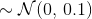

# tf-DNC

This is a reimplementation of Deepmind's Differentiable Neural Computer, as published in Nature:

[Hybrid computing using a neural network with dynamic external memory", Nature 538, 471–476 (October 2016) doi:10.1038/nature20101](https://www.nature.com/nature/journal/v538/n7626/pdf/nature20101.pdf).

The aim of this repo is to provide an intuitive and understandable implementation, whilst also reproducing the main results from the paper. Pull requests are very welcome for both fixes and clarifications in comments.

The DNC cell implements the Keras Layer API. There is a tentative Tensorflow 2.0 training script `babi/train_eager.py` which is currently much slower than the graph-based `train.py`.

## Requirements

- python3 (>=3.6.8)
- python3-pip
- make

## Development

Development is managed by a Makefile with various targets:
```
- make clean        # restore clean environment
- make deps         # install python3 dependencies
- make check        # enforces linting compliance
- make test         # exercises tests
- make viz          # brings up interactive graph via tensorboard
- make babi         # begin training on the babi dataset
```

## Reproduce Paper's Results

To train on the en-10k babi dataset:
```
$ make deps
$ make test
$ python3 babi/train.py --checkpoint_dir=model --num_training_iterations=590000
$ python3 babi/test.py --checkpooint_file=model/model.ckpt-590000
```

## Babi Results

[babi](https://research.fb.com/downloads/babi/) is a dataset where "the aim is that each task tests a unique aspect of text and reasoning, and hence test different capabilities of learning models." Here, the aim was to reproduce 'Extended Data Table 1' from the nature paper.

We trained an identical model to 'DNC1' with the following hyperparmeters for 590,000 iterations:

|  | DNC  (ours) and DNC1 (Deepmind) |
| --- | --- |
| LSTM Contoller Size | 256 |
| Batch Size | 1 |
| Learning Rate | 1e-4 |
| Memory Size | 256 x 64 |
| Read Heads | 4 |
| Write Heads | 1 |
| Optimizer | RMSProp, momentum=0.9
| Weight Initialization |  |


Results after one run on CPU, classic_dnc_output=False (see implementation for details), Fedora 27 for ~1 week of training:

| Task | DNC (ours) | DeepMind DNC1 | DeepMind LSTM 512 |
| -----|------------|-------------- |-------------------|
| 1. 1 supporting fact   | **0.0**      | 9.0 &plusmn; 12.6        | 28.4 &plusmn; 1.5 |
| 2. 2 supporting facts  | **3.5**      | 32.0 &plusmn; 20.5   | 56.0 &plusmn; 1.5 |
| 3. 3 supporting facts  | **24.5**     | 39.6 &plusmn; 16.4       | 51.3 &plusmn; 1.4 |
| 4. 2 argument rels.    | 0.8     |  **0.4 &plusmn; 0.7**    | 0.8 &plusmn; 0.5  |
| 5. 3 argument rels.    | 1.6      | **1.5 &plusmn; 1.0**         | 3.2 &plusmn; 0.5  |
| 6. yes/no questions    | **0.3**      | 6.9 &plusmn; 7.5         | 15.2 &plusmn; 1.5 |
| 7. counting            | **5.62**     | 9.8 &plusmn; 7.0         | 16.4 &plusmn; 1.4 |
| 8. lists/sets          | **2.7**      | 5.5 &plusmn; 5.9         | 17.7 &plusmn; 1.2 |
| 9. simple negation     | **0.1**      | 7.7 &plusmn; 8.3         | 15.4 &plusmn; 1.5 |
| 10. indefinite knowl.  | **1.3**      | 9.6 &plusmn; 11.4        | 28.7 &plusmn; 1.7 |
| 11. basic coreference  | **0.0**      | 3.3 &plusmn; 5.7         | 12.2 &plusmn; 3.5 |
| 12. conjuction         | **0.5**      | 5.0 &plusmn; 6.3         | 5.4 &plusmn; 0.6  |
| 13. compound coref.    | **0.1**      | 3.1 &plusmn; 3.6         | 7.2 &plusmn; 2.3  |
| 14. time reasoning     | 17.7     | **11.0 &plusmn; 7.5**    | 55.9 &plusmn; 1.2 |
| 15. basic deduction    | 42.9     | **27.2 &plusmn; 20.1**       | 47.0 &plusmn; 1.7 |
| 16. basic induction    | **52.5**     | 53.6 &plusmn; 1.9        | 53.3 &plusmn; 1.3 |
| 17. positional reas.   | 38.8     | **32.4 &plusmn; 8.0**        | 34.8 &plusmn; 4.1 |
| 18. size reasoning     | 10.3     | **4.2 &plusmn; 1.8**         | 5.0 &plusmn; 1.4  |
| 19. path finding       | 88.25    | **64.6 &plusmn; 37.4**   | 90.9 &plusmn; 1.1 |
| 20. agent motiv.       | 1.90     | **0.0 &plusmn; 0.1**     | 1.3 &plusmn; 0.4  |
| **Mean Error (%)**     | **14.7**    | 16.7 &plusmn; 7.6        | 27.3 &plusmn; 0.8 |
| **Failed (Error > 5%)**| **8**        | 11.2 &plusmn; 5.4        | 17.1 &plusmn; 1.0 |

I believe that the loss would have continued to decrease had I continued training for longer, unfortunately my SSD failed at 590,000 iterations.

## Explore the architecture

The model has been carefully defined using Tensorflow's named scopes in the computational graph to make visualization as instructive as possible. As such, a useful introduction to understanding the DNC architecture is simply to run `$ make viz` and explore the graph interactively in your browser at `http://localhost:6006`.


## License

[MIT](LICENSE)
